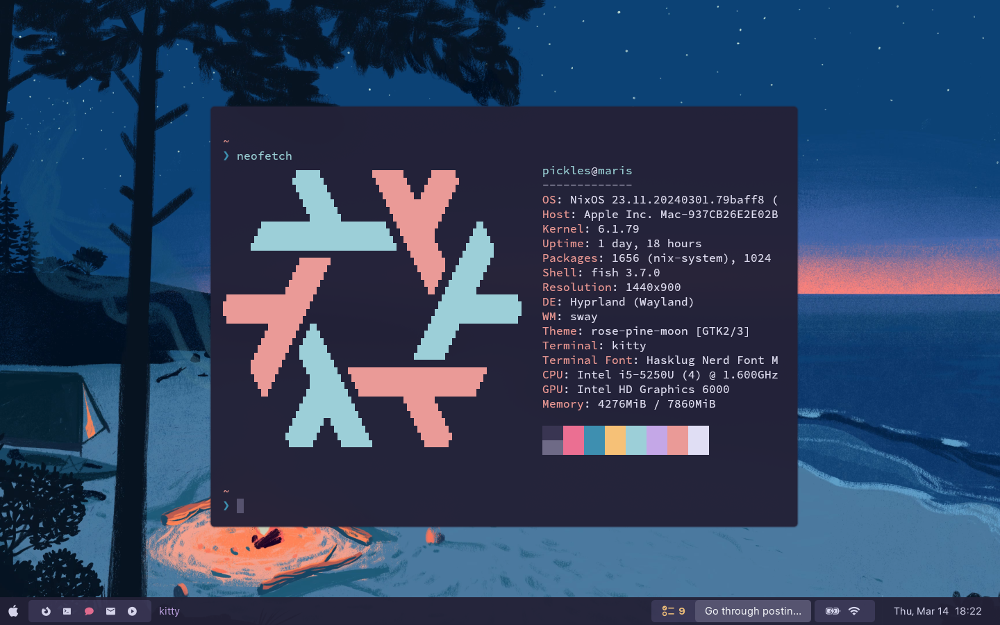

# dotfiles

| Platform | Preview |
|:--------:|:-------:|
| NixOS (personal) |  |
| macOS (work) |  |

Just my dotfiles. Everything is managed with [GNU Stow](https://www.gnu.org/software/stow/).

## Installation

Depending on platform, these are the installation instructions.

|  Platform | Install instructions |
|:---------:|---------------------:|
|     NixOS |    (Quick script TK) |
|     macOS |   `./macos/setup.sh` |
